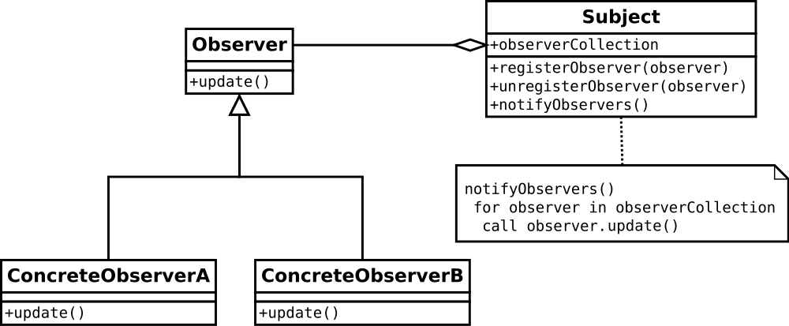

# Observer Pattern

观察者模式是一种软件设计模式，使用观察者模式可以帮助设计出灵活的、能复用的软件。当一个对象（观察者模式里称为 Subject）改变，其他很多对象（观察者模式里称为 Observer）需要跟着改变时，就可以使用观察者模式。这种一对多关系里，虽然可以在 Subject 直接调用 Observer 方法对 Observer 进行更新，但这么做会让 Subject 和 Observer 紧耦合，并且 Observer 们可能难以复用，使用 Observer Pattern 可以实现相同的功能且减少耦合，让代码更容易复用。

[维基百科](https://en.wikipedia.org/wiki/Observer_pattern)里提供了 Observer Pattern 的 UML 类图，如下所示。



Subject 对象维护了一个集合，此集合里保存着它的观察者们。Subject 还有 3 个方法，registerObserver 方法将 Observer 对象注册到集合里，unregisterObserver 方法将 Observer 对象从集合里注销，notifyObservers 方法是通知所有的 Observer 对象进行更新。

Observer 对象至少有一个方法，UML 类图里叫 update。Subject 的 notifyObservers 方法里会调用所有的 Observer 对象的 update 方法，达到通知所有 Observer 的目的。

维基百科里还给了 Java 实现 Observer Pattern 的示例代码，如下所示。

```java
import java.util.ArrayList;
import java.util.List;
import java.util.Scanner;

interface Observer {
    void update(String event);
}
  
class EventSource {
    List<Observer> observers = new ArrayList<>();
  
    public void notifyObservers(String event) {
        observers.forEach(observer -> observer.update(event));
    }
  
    public void addObserver(Observer observer) {
        observers.add(observer);
    }
  
    public void scanSystemIn() {
        Scanner scanner = new Scanner(System.in);
        while (scanner.hasNextLine()) {
            String line = scanner.nextLine();
            notifyObservers(line);
        }
    }
}

public class ObserverDemo {
    public static void main(String[] args) {
        System.out.println("Enter Text: ");
        EventSource eventSource = new EventSource();
        
        eventSource.addObserver(event -> System.out.println("Received response: " + event));

        eventSource.scanSystemIn();
    }
}
```

观察者模式还是比较容易理解，实现也不难，在合适的场景使用它肯定会让代码变的简洁和易于维护。

为什么在本文里笔者要提及 Spring Event ，因为笔者在使用 Spring Event 时觉得 Spring Event 和 Observer Pattern 有很多相似地方，如果简化 Spring Event 设计，得到的 UML 类图和 Observer Pattern UML 类图不一样，但它们两者都达到了让 Subject 和 Observer 低耦合且让代码更易复用的目的。怀揣着对 Spring Event 实现的好奇，笔者开始了阅读 Spring Event 源码之旅。

# Spring Event

Spring Event 是 Spring Framework 里的功能，在 Spring Boot 项目里能直接使用，Spring Event 源码位于 `spring-context` module 里面。

```bash
spring-framework % ls                                                                      
CODE_OF_CONDUCT.adoc            gradlew.bat                     spring-jdbc                
CONTRIBUTING.md                 import-into-eclipse.md          spring-jms                 
LICENSE.txt                     import-into-idea.md             spring-messaging           
README.md                       integration-tests               spring-orm                 
SECURITY.md                     settings.gradle                 spring-oxm                 
build                           spring-aop                      spring-r2dbc               
build.gradle                    spring-aspects                  spring-test                
buildSrc                        spring-beans                    spring-tx                  
ci                              spring-context 👈 HERE          spring-web                 
framework-api                   spring-context-indexer          spring-webflux             
framework-bom                   spring-context-support          spring-webmvc              
framework-docs                  spring-core                     spring-websocket           
framework-platform              spring-core-test                src                        
gradle                          spring-expression               update_copyright_headers.sh
gradle.properties               spring-instrument                                          
gradlew                         spring-jcl                                                 
spring-framework %  
```

## Spring Event 使用示例

在分析 Spring Event 源码前，可能读者对 Spring Event 用法不太了解，笔者准备了一个简单示例，直观地让读者感受下如何使用 Spring Event。

```java
package com.poc.samples.springeventtutorial;

import lombok.AllArgsConstructor;
import lombok.Data;
import lombok.NoArgsConstructor;
import lombok.ToString;
import lombok.extern.slf4j.Slf4j;
import org.springframework.context.ApplicationEventPublisher;
import org.springframework.web.bind.annotation.PostMapping;
import org.springframework.web.bind.annotation.RequestParam;
import org.springframework.web.bind.annotation.RestController;

import java.util.Date;

@Slf4j
@RestController
public class PaymentController {
    private final ApplicationEventPublisher applicationEventPublisher;

    public PaymentController(ApplicationEventPublisher applicationEventPublisher) {
        this.applicationEventPublisher = applicationEventPublisher;
    }

    @PostMapping(value = "/api/v1/payment/callback")
    public String paymentCallback(@RequestParam Boolean resultSuccess) {
        return this.paymentSuccess(resultSuccess);
    }

    public String paymentSuccess(Boolean result) {
        if (!result) {
            return "Not OK!";
        }
        PaymentSuccessEvent event = new PaymentSuccessEvent();
        event.setResult("OK");
        event.setTime(new Date().toString());
        this.applicationEventPublisher.publishEvent(event);
        log.info("Sent event to listener.");
        return "OK!";
    }

    @Data
    @NoArgsConstructor
    @AllArgsConstructor
    @ToString
    public static class PaymentSuccessEvent {
        private String time;
        private String result;
    }
}


package com.poc.samples.springeventtutorial;

import lombok.extern.slf4j.Slf4j;
import org.springframework.context.event.EventListener;
import org.springframework.stereotype.Service;

@Slf4j
@Service
public class PaymentEventListener {
    @EventListener
    public void onApplicationEvent(PaymentController.PaymentSuccessEvent event) {
        log.info("PaymentEventListener received event: {}", event);
    }
}

```

在 Spring Boot 项目里使用 Spring Event 非常简单，如上面代码所示。启动项目后执行下面的 curl 命令就能运行代码。

```bash
curl -XPOST 'http://localhost:8080/api/v1/payment/callback?resultSuccess=true'
```

项目会打印如下日志：

```bash
2024-08-18T09:59:16.243+08:00  INFO 25460 --- [spring-event-tutorial] [nio-8080-exec-4] c.p.s.s.PaymentEventListener             : PaymentEventListener received event: PaymentController.PaymentSuccessEvent(time=Sun Aug 18 09:59:16 CST 2024, result=OK)
2024-08-18T09:59:16.246+08:00  INFO 25460 --- [spring-event-tutorial] [nio-8080-exec-4] c.p.s.s.PaymentController                : Sent event to listener.
```

## 源码分析

笔者将 Spring Event 源码分成 4 个部分，文章后面的段落会分别分析这些源码。

1. 事件 （Event）
2. 观察者 （Observer / Listener）
3. 被观察者 （Subject / EventSource）
4. 事件发送器 （EventPublisher，Spring Event 独有的组件）

笔者阅读的 `spring-context` 版本是 6.1.11。

### 事件 event

在 Spring Event 里所谓的 Event 就是指`被观察者`发送给`观察者`的内容，也就是上面示例代码里的 `PaymentSuccessEvent`。

```java
@Data
@NoArgsConstructor
@AllArgsConstructor
@ToString
public static class PaymentSuccessEvent {
    private String time;
    private String result;
}
```

读者需要注意的是，在 `spring-context` 4.2 版本之前，定义 Event 类时必须要继承 `ApplicationEvent` 类；在 4.2 版本之后可以继续继承 `ApplicationEvent` 类，也可以不继承，就像示例的 `PaymentSuccessEvent` 一样。

```java
@FunctionalInterface
public interface ApplicationEventPublisher {
	
	default void publishEvent(ApplicationEvent event) {
		publishEvent((Object) event);
	}
	
	void publishEvent(Object event);
}

// 可以看到发送 Event 的 ApplicationEventPublisher 是一个 interface，
// 它有 2 个方法：publishEvent(ApplicationEvent event) 和 publishEvent(Object event)。
// publishEvent((Object) event) 方法也是调用的 publishEvent(Object event)，
// 所以看 publishEvent(Object event) 实现既可。


// 最终实现 publishEvent(Object event) 方法的代码在 AbstractApplicationContext 类里。

public abstract class AbstractApplicationContext extends DefaultResourceLoader
		implements ConfigurableApplicationContext {
  
  @Override
	public void publishEvent(Object event) {
		publishEvent(event, null);
	}
  
  // publishEvent(Object event) 调用的是内部重载方法 publishEvent(event, null)。
  
  protected void publishEvent(Object event, @Nullable ResolvableType typeHint) {
	Assert.notNull(event, "Event must not be null");
	ResolvableType eventType = null;

	ApplicationEvent applicationEvent;
	if (event instanceof ApplicationEvent applEvent) {
		applicationEvent = applEvent;
		eventType = typeHint;
	}	else {
		ResolvableType payloadType = null;
		if (typeHint != null && ApplicationEvent.class.isAssignableFrom(typeHint.toClass())) {
			eventType = typeHint;
		}	else {
			payloadType = typeHint;
		}
    // typeHint = null 时，构造 PayloadApplicationEvent 时传入的 payloadType 也是 null
		applicationEvent = new PayloadApplicationEvent<>(this, event, payloadType);
	}
    // ... 省略和 Event 无关的代码 
    // 读者先忽略 ResolvableType 类型的 eventType, payloadType 变量，后面会介绍它们。
    
    // 从上面的 if-else 可以看到，如果 event 是 ApplicationEvent 类型，
    // 则不做特殊处理。如果 event 不是 ApplicationEvent 类型，会创建一个
    // PayloadApplicationEvent 对象并将 event 当作参数传递进去，并赋值
    // 给 applicationEvent 变量。故，不管开发者使发送的是什么类型的 Event
    // 在 Spring Event 内部，event 都被转成了 ApplicationEvent 格式（
    // PayloadApplicationEvent 继承了 ApplicationEvent），即在 Spring Event
    // 内部对 event 类型进行了统一。
    
    // 🌟 在此处使用了 Java 17 新增的 instanceof 用法，叫 Pattern Matching。
    // Pattern Matching 好处是省略了 instanceof 关键字返回 true 时要手动把 instanceof 关键字左边的
    // 参数转变成 instanceof 右边类型的代码。比如 Java 17 前代码要这么写：
    // if (event instanceof ApplicationEvent) {
    //   applicationEvent = (ApplicationEvent) event;
    // }
    // 新的 instanceof 关键字可以直接取 Pattern Matching 定义的变量。
    // Pattern Matching 详情可以看 https://docs.oracle.com/en/java/javase/17/language/pattern-matching-instanceof-operator.html
    
  }
}
```

事件部分比较简单，读者知道在 Spring Event 内部只有一个 `ApplicationEvent` Event 格式即可，虽然 `ApplicationEventPublisher` 可以发送任何类型的 event，但内部都是用 `ApplicationEvent` 承载。

### 事件发送器 EventPublisher

事件发送器 ApplicationEventPublisher 的实现代码在 AbstractApplicationContext 里，在上个段落里介绍 Event 时已经看了前半部分代码，接着看后面和 EventPublisher 有关的逻辑。

```java
// org.springframework.context.support.AbstractApplicationContext#publishEvent(java.lang.Object, org.springframework.core.ResolvableType)
protected void publishEvent(Object event, @Nullable ResolvableType typeHint) {
	Assert.notNull(event, "Event must not be null");
	ResolvableType eventType = null;
	// 上面说过，需要的话将 event 装饰成 ApplicationEvent，
	// 内部统一成 ApplicationEvent 承载数据。
	ApplicationEvent applicationEvent;
	if (event instanceof ApplicationEvent applEvent) {
		applicationEvent = applEvent;
		eventType = typeHint;
	}	else {
		ResolvableType payloadType = null;
		// ApplicationEvent.class.isAssignableFrom() 方法判断 typeHint.toClass() 的值是不是
 		// ApplicationEvent 的子类、子接口。
		if (typeHint != null && ApplicationEvent.class.isAssignableFrom(typeHint.toClass())) {
			eventType = typeHint;
		} else {
			payloadType = typeHint;
		}
 		// 此处传入 payloadType 是为了下方用来计算 eventType。
		applicationEvent = new PayloadApplicationEvent<>(this, event, payloadType);
	}
	// Determine event type only once (for multicast and parent publish)
	if (eventType == null) {
		// 上面还未计算 eventType 时此处进行计算，在这里 
		// new PayloadApplicationEvent<>(this, event, payloadType) 时传入的 payloadType 派上了用场。
		eventType = ResolvableType.forInstance(applicationEvent);
     
		if (typeHint == null) {
			typeHint = eventType;
		}
	}
	// 此处用到了 ResolvableType 类型，ResolvableType 会一直往下传递，并用它来判断需要将此 Event 传递给哪些
	// Observer(Listener)，所以需要插入介绍下 ResolvableType 是什么。下面是 ResolvableType 的类注释： 
	//
	// Encapsulates a Java Type, providing access to supertypes, interfaces,
	// and generic parameters along with the ability to ultimately resolve to a Class.
	// A ResolvableType may be obtained from a field, a method parameter,
	// a method return type, or a class. Most methods on this class will themselves
	// return a ResolvableType, allowing for easy navigation. For example:
	//   private HashMap<Integer, List<String>> myMap;
	//  
	//   public void example() {
	//       ResolvableType t = ResolvableType.forField(getClass().getDeclaredField("myMap"));
	//       t.getSuperType(); // AbstractMap<Integer, List<String>>
	//       t.asMap(); // Map<Integer, List<String>>
	//       t.getGeneric(0).resolve(); // Integer
	//       t.getGeneric(1).resolve(); // List
	//       t.getGeneric(1); // List<String>
	//       t.resolveGeneric(1, 0); // String
	//   }	
}
```

读完 ResolvableType 的类注释后，好像能明白了它能做什么，但又不完全明白它能做什么。"Encapsulates a Java Type" 什么是 Java Type? 在 ResolvableType 源码里可以看到 Java Type 是指 `java.lang.reflect.Type`。

```java
public class ResolvableType implements Serializable {
	/**
	 * The underlying Java type being managed.
	 */
	private final Type type;
 
  ... 
}
```


```java
package java.lang.reflect;

/**
 * Type is the common superinterface for all types in the Java
 * programming language. These include raw types, parameterized types,
 * array types, type variables and primitive types.
 *
 * @jls 4.1 The Kinds of Types and Values
 * @jls 4.2 Primitive Types and Values
 * @jls 4.3 Reference Types and Values
 * @jls 4.4 Type Variables
 * @jls 4.5 Parameterized Types
 * @jls 4.8 Raw Types
 * @jls 4.9 Intersection Types
 * @jls 10.1 Array Types
 * @since 1.5
 */
public interface Type {
    /**
     * Returns a string describing this type, including information
     * about any type parameters.
     *
     * @implSpec The default implementation calls {@code toString}.
     *
     * @return a string describing this type
     * @since 1.8
     */
    default String getTypeName() {
        return toString();
    }
}
```

`java.lang.reflect.Type` 位于 reflect 包路径下，和它同路径下的还有 `java.lang.reflect.Constructor`, `java.lang.reflect.Parameter`, `java.lang.reflect.Field` 等 reflect 常用的类。`java.lang.reflect.Type` 能代表 Java 里的类型，像基本类型（primitivie types）、数组（array types）、参数化类型（parameterized types）、交叉类型（intersection types）等都能被代表。Class 类型就实现了 Type 接口，如下：

```java
public final class Class<T> implements java.io.Serializable,
                              GenericDeclaration,
                              Type, // 👈
                              AnnotatedElement,
                              TypeDescriptor.OfField<Class<?>>,
                              Constable {...}
```

下面示例里演示了用 Type 来获取方法返回值：

```java
import java.lang.reflect.Method;
import java.lang.reflect.ParameterizedType;
import java.lang.reflect.Type;
import java.util.List;

public class Example {
    public List<String> getStringList() {
        return null;
    }

    public static void main(String[] args) throws NoSuchMethodException {
        Method method = Example.class.getMethod("getStringList");
        Type returnType = method.getGenericReturnType(); // 👈

        if (returnType instanceof ParameterizedType) {
            ParameterizedType parameterizedType = (ParameterizedType) returnType;
            Type[] actualTypeArguments = parameterizedType.getActualTypeArguments();
            for (Type type : actualTypeArguments) {
                System.out.println("Type argument: " + type.getTypeName());
            }
        } else {
            System.out.println("The return type is not parameterized.");
        }
    }
}
// 运行程序打印 Type argument: java.lang.String
```

知道 Type 是什么后，我们回到 ResolvableType 是什么的问题上。

ResolvableType 封装了 Type，并提供如下一组 "for" 开头的方法构建得到 ResolvableType 对象：



可以看到，能从 `Class, Object, Field, MethodReturnType, Type` 等类型构建得到 ResolvableType 实例。

有 ResolvableType 实例后有如下方法可以使用：



待补充

介绍完 `ResolvableType` 类型后，回归主线，继续看 EventPublisher 代码。

```java
// org.springframework.context.support.AbstractApplicationContext#publishEvent(java.lang.Object, org.springframework.core.ResolvableType)
protected void publishEvent(Object event, @Nullable ResolvableType typeHint) {
	Assert.notNull(event, "Event must not be null");
	ResolvableType eventType = null;
	// 需要的话将 event 装饰成 ApplicationEvent
	ApplicationEvent applicationEvent;
	if (event instanceof ApplicationEvent applEvent) {
		applicationEvent = applEvent;
		eventType = typeHint;
	}	else {
		ResolvableType payloadType = null;
		if (typeHint != null && ApplicationEvent.class.isAssignableFrom(typeHint.toClass())) {
			eventType = typeHint;
		} else {
			payloadType = typeHint;
		}
		applicationEvent = new PayloadApplicationEvent<>(this, event, payloadType);
	}
 
	// Determine event type only once (for multicast and parent publish)
	if (eventType == null) {
		eventType = ResolvableType.forInstance(applicationEvent);
     
		if (typeHint == null) {
			typeHint = eventType;
		}
	}
	// Multicast right now if possible - or lazily once the multicaster is initialized
	if (this.earlyApplicationEvents != null) {
		this.earlyApplicationEvents.add(applicationEvent);
	} else if (this.applicationEventMulticaster != null) {
		this.applicationEventMulticaster.multicastEvent(applicationEvent, eventType);
	}
	// 上面一段代码，当 earlyApplicationEvents 不为 null 时，把 event 放到它里面。
	// earlyApplicationEvents 是 Set<ApplicationEvent> 类型，为什么要把 event 放到 Set 里呢？
	// event 应该直接发送给 Listener 才对。 
	// 读者看完 Spring Event 源码后会明白原因，笔者提前说下：这一步的目的是解决 bean 在初始化时
	// "事件广播器" ApplicationEventMulticaster 还未被初始化不能发送 event 的问题，故先把 event 暂存，
	// 等到 "事件广播器" ApplicationEventMulticaster 被初始化完成后再把这些 event 发送出去。
	//
	//
	//
	//
	//
	// 当 this.applicationEventMulticaster 不为 null 时，
	// Publish event via parent context as well...
	if (this.parent != null) {     
		if (this.parent instanceof AbstractApplicationContext abstractApplicationContext) {
			abstractApplicationContext.publishEvent(event, typeHint);
		} else {
			this.parent.publishEvent(event);
		}
	}
}
```

1

```java
public void refresh() throws BeansException, IllegalStateException {
	this.startupShutdownLock.lock();
	try {
		this.startupShutdownThread = Thread.currentThread();
		StartupStep contextRefresh = this.applicationStartup.start("spring.context.refresh");
		prepareRefresh();
		ConfigurableListableBeanFactory beanFactory = obtainFreshBeanFactory();
		prepareBeanFactory(beanFactory);
		try {
			postProcessBeanFactory(beanFactory);
			StartupStep beanPostProcess = this.applicationStartup.start("spring.context.beans.post-process");
			invokeBeanFactoryPostProcessors(beanFactory);
			registerBeanPostProcessors(beanFactory);
			beanPostProcess.end();
			initMessageSource();
			initApplicationEventMulticaster(); // 这个方法对"事件广播器"进行初始化
			onRefresh();
			registerListeners(); // 这个方法处理暂存的事件，对外发送
			finishBeanFactoryInitialization(beanFactory);
			finishRefresh();
		} catch (RuntimeException | Error ex ) {
			if (logger.isWarnEnabled()) {
				logger.warn("Exception encountered during context initialization - " +
						"cancelling refresh attempt: " + ex);
			}
			destroyBeans();
			cancelRefresh(ex);
			throw ex;
		} finally {
			contextRefresh.end();
		}
	} finally {
		this.startupShutdownThread = null;
		this.startupShutdownLock.unlock();
	}
}
```


### 观察者 Observer / Listener

# 避免到处发送 Event
